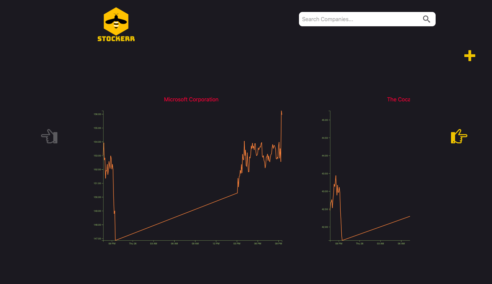
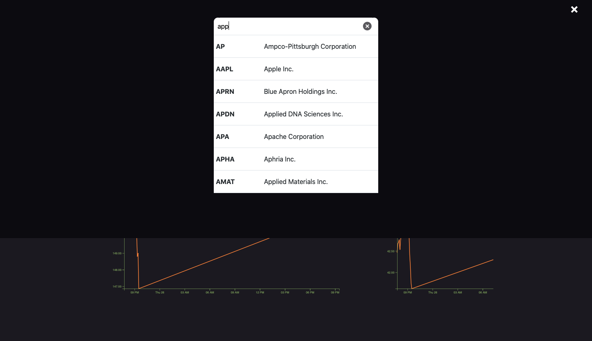
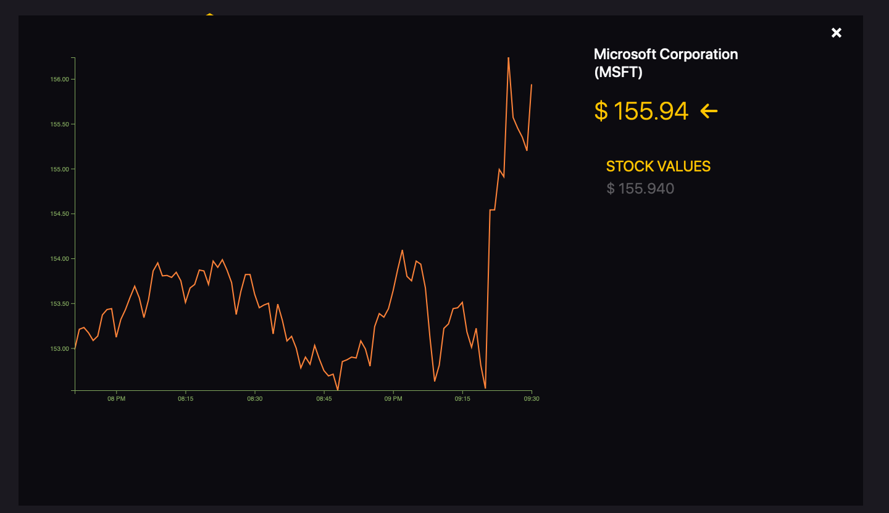

Stockerr
========
### A React web app that allows user to learn latest stock prices, add stocks to collection and track stocks.

### Data source : Alpha Vantage API for stocks (<https://www.alphavantage.co/documentation/>).


## How To Run :
1. Clone the repository 

   ``` git clone https://github.com/NKwatra/Stockerr.git```
2. Get your free Alpha Vantage API key at  <https://www.alphavantage.co/support/#api-key> 
3. Create **api.js** file in root directory of repository and add below line to file

    ``` export const REACT_APP_ALPHA_VANTAGE = <your API key> ```
4. Enter `npm run start ` into the terminal.


## Sample Run






